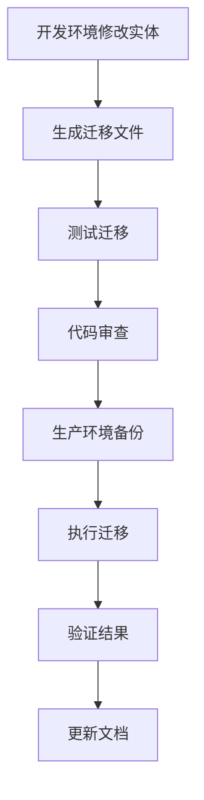

# Doctrine 迁移系统分析报告与解决方案

## 📋 执行摘要

本报告分析了当前项目中分布式锁表创建的混乱状态，并提供了使用标准 Symfony/Doctrine 方式管理数据库结构的完整解决方案。

## 🔍 问题分析

### 1. 当前状态概述

项目中存在 **4 种不同的方式** 创建分布式锁表，导致严重的混乱状态：

1. **Doctrine 迁移文件** - `migrations/Version20251204084207.php`
2. **Symfony 命令** - `src/Command/CreateDistributedLocksTableCommand.php`
3. **直接 SQL 脚本** - `public/create_distributed_locks_table.php`
4. **原始 SQL 文件** - `create_distributed_locks_table.sql`

### 2. 关键问题识别

#### 🚨 严重问题：命名不一致

| 组件                | 字段命名              | 状态              |
| ------------------- | --------------------- | ----------------- |
| **实体定义**        | `lockKey`, `lockId`   | ❌ 驼峰命名       |
| **数据库字段**      | `lock_key`, `lock_id` | ❌ 下划线命名     |
| **SQL 查询**        | `lock_key`, `lock_id` | ❌ 直接使用下划线 |
| **Repository 查询** | `lockKey`, `lockId`   | ❌ 使用实体属性名 |

#### 🚨 迁移系统冲突

1. **直接执行 SQL** 绕过了 Doctrine 迁移系统
2. **迁移状态表** 可能与实际数据库结构不同步
3. **多种创建方式** 导致不确定当前使用的是哪种结构
4. **生产环境风险** 无法追踪数据库变更历史

#### 🚨 代码质量问题

发现了 **14 个不同的 PHP 脚本** 直接操作 `distributed_locks` 表：

-   `public/fix_distributed_lock_migration.php`
-   `public/comprehensive_lock_fix.php`
-   `public/create_distributed_locks_table.php`
-   `public/fix_distributed_lock_final.php`
-   `public/fix_expire_time_column.php`
-   等等...

## 🏗️ 解决方案

### 阶段 1：清理现有混乱状态

#### 1.1 备份当前数据

```bash
# 创建数据备份
mysqldump -u root -p official_website distributed_locks > distributed_locks_backup_$(date +%Y%m%d_%H%M%S).sql
```

#### 1.2 清理无关文件

需要删除或重构以下文件：

-   所有 `public/` 目录下的锁相关脚本
-   重复的 SQL 创建脚本
-   临时修复脚本

### 阶段 2：修复实体定义

#### 2.1 统一字段命名

修正 [`src/Entity/DistributedLock.php`](src/Entity/DistributedLock.php:1)：

```php
#[ORM\Column(name: 'lock_key', type: 'string', length: 255, unique: true)]
private ?string $lockKey = null;

#[ORM\Column(name: 'lock_id', type: 'string', length: 255)]
private ?string $lockId = null;

#[ORM\Column(name: 'expire_time', type: 'datetime')]
private ?\DateTimeInterface $expireTime = null;

#[ORM\Column(name: 'created_at', type: 'datetime')]
private ?\DateTimeInterface $createdAt = null;
```

#### 2.2 更新 Repository 查询

修正 [`src/Repository/DistributedLockRepository.php`](src/Repository/DistributedLockRepository.php:1) 中的查询，确保使用正确的字段映射。

### 阶段 3：创建正确的迁移

#### 3.1 生成新的迁移文件

```bash
php bin/console doctrine:migrations:diff
```

#### 3.2 迁移文件示例

```php
<?php

declare(strict_types=1);

namespace DoctrineMigrations;

use Doctrine\DBAL\Schema\Schema;
use Doctrine\Migrations\AbstractMigration;

final class Version20251205000000 extends AbstractMigration
{
    public function getDescription(): string
    {
        return '创建分布式锁表 - 修复字段命名不一致问题';
    }

    public function up(Schema $schema): void
    {
        $this->addSql('CREATE TABLE distributed_locks (id INT AUTO_INCREMENT NOT NULL, lock_key VARCHAR(255) NOT NULL, lock_id VARCHAR(255) NOT NULL, expire_time DATETIME NOT NULL, created_at DATETIME NOT NULL, UNIQUE INDEX UNIQ_3327048557F10DA4 (lock_key), INDEX idx_expire_time (expire_time), PRIMARY KEY(id)) DEFAULT CHARACTER SET utf8mb4 COLLATE `utf8mb4_unicode_ci` ENGINE = InnoDB');
    }

    public function down(Schema $schema): void
    {
        $this->addSql('DROP TABLE distributed_locks');
    }
}
```

### 阶段 4：修复服务层

#### 4.1 统一数据库访问

修正 [`src/Service/DistributedLockService.php`](src/Service/DistributedLockService.php:1)：

```php
// 使用 EntityManager 而不是直接 SQL
public function acquireLock(string $lockKey, int $ttl = 60): bool
{
    $lock = new DistributedLock();
    $lock->setLockKey($lockKey);
    $lock->setLockId(md5($lockKey));
    $lock->setExpireTime((new \DateTime())->add(new \DateInterval("PT{$ttl}S")));

    try {
        $this->entityManager->persist($lock);
        $this->entityManager->flush();
        return true;
    } catch (\Exception $e) {
        // 处理唯一键冲突等异常
        return false;
    }
}
```

## 🏭 生产环境最佳实践

### 1. 数据库变更流程



### 2. 迁移执行命令

#### 开发环境

```bash
# 生成迁移
php bin/console doctrine:migrations:diff

# 执行迁移
php bin/console doctrine:migrations:migrate

# 查看迁移状态
php bin/console doctrine:migrations:list
```

#### 生产环境

```bash
# 1. 备份数据库
mysqldump -u root -p official_website > backup_before_migration_$(date +%Y%m%d_%H%M%S).sql

# 2. 检查待执行的迁移
php bin/console doctrine:migrations:migrate --dry-run

# 3. 执行迁移（在维护窗口期间）
php bin/console doctrine:migrations:migrate --env=prod

# 4. 验证迁移结果
php bin/console doctrine:migrations:list
```

### 3. 监控和回滚

#### 迁移失败处理

```bash
# 查看最后执行的迁移
php bin/console doctrine:migrations:latest

# 回滚到指定版本
php bin/console doctrine:migrations:migrate Version20251204084207

# 验证数据库状态
php bin/console doctrine:schema:validate
```

## 📝 实施计划

### 第一步：立即执行（高优先级）

1. ✅ **备份当前数据**
2. ✅ **删除临时脚本**
3. ✅ **修复实体定义**

### 第二步：短期执行（中优先级）

1. 🔄 **生成正确迁移**
2. 🔄 **更新服务层代码**
3. 🔄 **测试迁移流程**

### 第三步：长期维护（低优先级）

1. 📋 **建立 CI/CD 集成**
2. 📋 **创建迁移检查脚本**
3. 📋 **编写操作文档**

## 🔧 工具和脚本

### 迁移状态检查脚本

```php
<?php
// scripts/check_migration_status.php
require_once __DIR__ . '/../vendor/autoload.php';

use App\Kernel;

$kernel = new Kernel('prod', false);
$kernel->boot();

$connection = $kernel->getContainer()->get('doctrine.orm.entity_manager')->getConnection();

echo "=== 迁移状态检查 ===\n";

// 检查迁移表
$result = $connection->executeQuery("SELECT version, executed_at FROM doctrine_migration_versions ORDER BY version DESC");
echo "已执行的迁移：\n";
while ($row = $result->fetchAssociative()) {
    echo "  - {$row['version']}: {$row['executed_at']}\n";
}

// 验证数据库结构
echo "\n数据库结构验证：\n";
passthru("php bin/console doctrine:schema:validate");

$kernel->shutdown();
```

## 📊 风险评估

### 高风险

-   **数据丢失** - 迁移过程中的备份不完整
-   **服务中断** - 迁移执行时间过长
-   **回滚失败** - 迁移后无法正确回滚

### 中风险

-   **性能影响** - 大表迁移导致的性能问题
-   **兼容性问题** - 新旧代码版本冲突

### 缓解措施

1. **完整备份** - 执行前必须备份
2. **分步执行** - 分阶段验证
3. **监控告警** - 实时监控迁移状态
4. **回滚计划** - 准备完整的回滚方案

## 🎯 成功标准

### 技术指标

-   ✅ 所有迁移通过 `doctrine:schema:validate`
-   ✅ 实体与数据库结构完全同步
-   ✅ 所有测试用例通过
-   ✅ 生产环境零停机迁移

### 流程指标

-   ✅ 建立标准的迁移流程
-   ✅ 移除所有临时 SQL 脚本
-   ✅ 团队培训完成
-   ✅ 文档更新完整

## 📚 相关文档

-   [Symfony Doctrine 迁移文档](https://symfony.com/doc/current/doctrine/migrations.html)
-   [Doctrine ORM 最佳实践](https://www.doctrine-project.org/projects/orm.html/en/latest/reference/best-practices.html)
-   [生产环境部署指南](PRODUCTION_ENV_GUIDE.md)

---

**报告生成时间**: 2025-12-05 03:12:34 UTC  
**分析师**: CodeRider (Architect Mode)  
**版本**: 1.0
