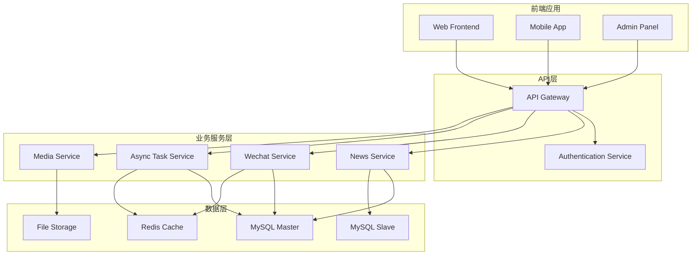
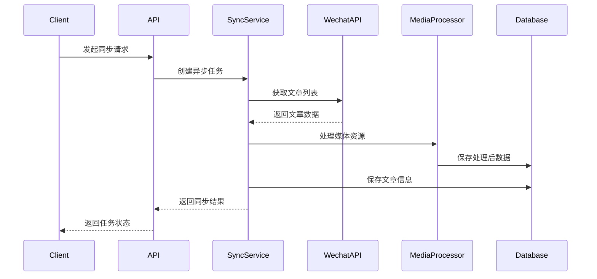
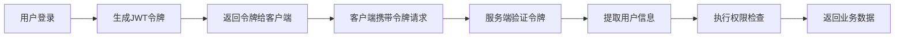
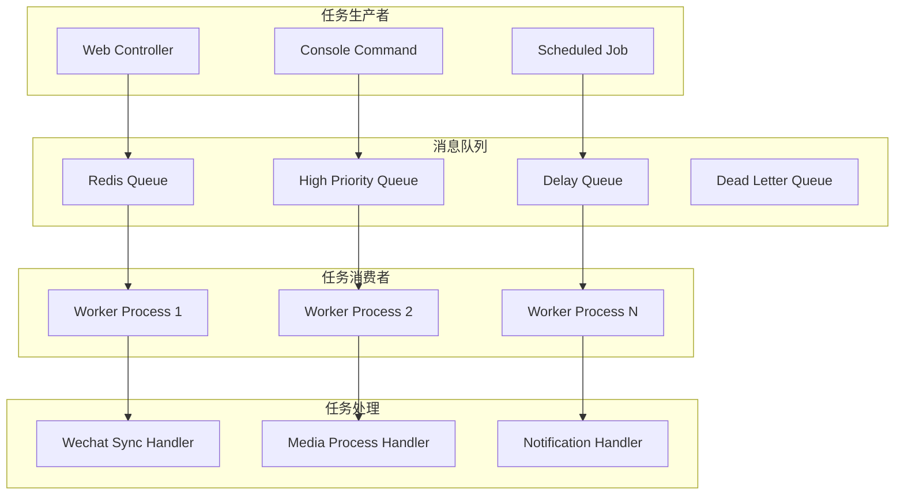
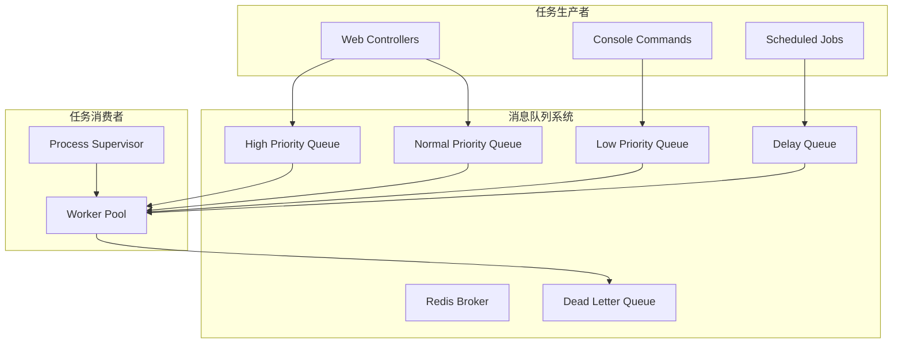
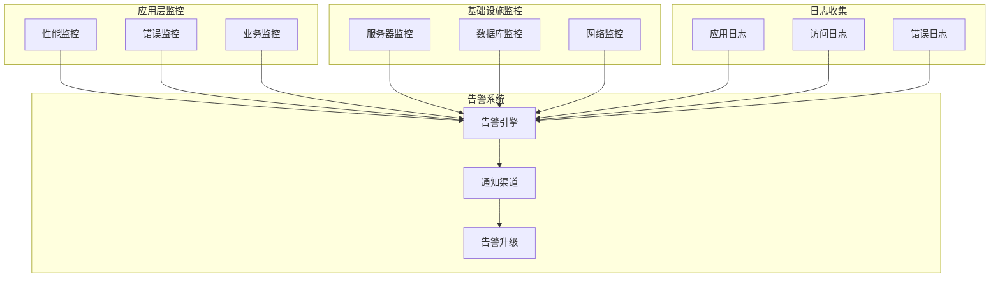

# 官方新闻网站后端系统 - 架构设计文档

## 📋 目录

1. [项目概述](#1-项目概述)
2. [系统架构设计](#2-系统架构设计)
3. [核心业务模块](#3-核心业务模块)
4. [数据库架构](#4-数据库架构)
5. [安全架构](#5-安全架构)
6. [异步处理架构](#6-异步处理架构)
7. [第三方集成](#7-第三方集成)
8. [监控和日志](#8-监控和日志)
9. [架构优势](#9-架构优势)
10. [技术决策说明](#10-技术决策说明)

---

## 1. 项目概述

### 项目名称和描述

**项目名称**: 官方新闻网站后端系统 (Official Website Backend System)

**项目描述**: 这是一个基于 Symfony 7.3 框架构建的企业级新闻网站后端系统，主要功能包括新闻文章管理、微信公众号内容同步、用户权限管理、异步任务处理等。系统采用现代化的微服务架构设计，支持高并发访问和海量数据处理。

### 项目目标和业务领域

**业务目标**:
- 提供稳定可靠的新闻内容管理平台
- 实现与微信公众号的无缝内容同步
- 支持多租户架构，服务多个商户
- 提供高性能的内容分发服务

**业务领域**:
- 新闻媒体内容管理
- 社交媒体内容集成
- 用户权限和访问控制
- 数据分析和统计

### 整体架构理念

**设计原则**:
- **分层架构**: 清晰的层次划分，职责分离
- **微服务化**: 模块化设计，独立部署和扩展
- **异步优先**: 耗时操作异步化，提升用户体验
- **高可用性**: 容错设计，故障自动恢复
- **可观测性**: 完整的监控和日志体系

---

## 2. 系统架构设计

### 分层架构图

```
┌─────────────────────────────────────────────────────────────┐
│                    API 网关层 (API Gateway)                   │
├─────────────────────────────────────────────────────────────┤
│                    控制器层 (Controllers)                     │
├─────────────────────────────────────────────────────────────┤
│                    服务层 (Services)                          │
├─────────────────────────────────────────────────────────────┤
│                    仓储层 (Repositories)                      │
├─────────────────────────────────────────────────────────────┤
│                    实体层 (Entities)                          │
├─────────────────────────────────────────────────────────────┤
│                    数据访问层 (Data Access)                    │
└─────────────────────────────────────────────────────────────┘
```

**架构层次说明**:

#### 1. API 网关层
- **职责**: 统一入口、路由分发、认证授权、限流控制
- **技术**: Symfony Router、API Platform、JWT认证
- **组件**: 
  - [`NewsController`](src/Controller/NewsController.php) - 新闻文章API
  - [`WechatController`](src/Controller/WechatController.php) - 微信同步API
  - [`AsyncTaskController`](src/Controller/AsyncTaskController.php) - 异步任务API

#### 2. 控制器层
- **职责**: 请求处理、参数验证、响应格式化
- **设计模式**: RESTful API设计
- **特性**: 
  - 统一的错误处理
  - 请求/响应DTO转换
  - API版本控制

#### 3. 服务层
- **职责**: 业务逻辑处理、事务管理、服务编排
- **核心服务**:
  - [`NewsPublishService`](src/Service/NewsPublishService.php) - 新闻发布服务
  - [`WechatArticleSyncService`](src/Service/WechatArticleSyncService.php) - 微信同步服务
  - [`MediaResourceProcessor`](src/Service/MediaResourceProcessor.php) - 媒体处理服务
  - [`AsyncTaskManager`](src/Service/AsyncTaskManager.php) - 异步任务管理

#### 4. 仓储层
- **职责**: 数据访问抽象、查询优化、缓存管理
- **实现**: Doctrine ORM Repository Pattern
- **特性**:
  - 查询构建器
  - 分页和排序
  - 关联查询优化

#### 5. 实体层
- **职责**: 数据模型定义、业务规则验证、生命周期管理
- **核心实体**:
  - [`SysNewsArticle`](src/Entity/SysNewsArticle.php) - 新闻文章实体
  - [`SysNewsArticleCategory`](src/Entity/SysNewsArticleCategory.php) - 文章分类实体
  - [`AsyncTask`](src/Entity/AsyncTask.php) - 异步任务实体
  - [`DistributedLock`](src/Entity/DistributedLock.php) - 分布式锁实体

#### 6. 数据访问层
- **职责**: 数据库连接、事务管理、连接池管理
- **技术**: Doctrine DBAL、MySQL连接池

### 各层职责说明

| 层级 | 主要职责 | 关键技术 | 性能指标 |
|------|----------|----------|----------|
| API网关 | 路由、认证、限流 | Symfony Router, JWT | 响应时间 < 100ms |
| 控制器 | 请求处理、验证 | REST API, DTO | 吞吐量 > 1000 QPS |
| 服务层 | 业务逻辑、事务 | Service Pattern | 业务处理 < 500ms |
| 仓储层 | 数据访问、查询 | Doctrine ORM | 查询优化 > 90% |
| 实体层 | 数据模型、规则 | ORM Entities | 数据一致性 99.9% |
| 数据访问 | 连接管理、事务 | MySQL, Connection Pool | 连接可用性 > 99% |

### 模块间交互关系



---

## 3. 核心业务模块

### 新闻文章管理模块

#### 模块概述
负责新闻文章的完整生命周期管理，包括创建、编辑、发布、归档等操作。

#### 核心功能
- **文章CRUD操作**: 完整的增删改查功能
- **预约发布系统**: 支持定时发布和状态自动切换
- **分类管理**: 多级分类体系和标签系统
- **搜索和过滤**: 全文搜索和多条件筛选
- **阅读统计**: 阅读量统计和热度分析

#### 技术实现

**实体设计**:
```php
class SysNewsArticle
{
    private int $id;
    private int $merchantId;
    private int $userId;
    private string $name;
    private string $cover;
    private string $content;
    private ?DateTime $releaseTime;
    private int $status; // 1:激活 2:非激活 3:已删除
    private bool $isRecommend;
    private int $viewCount;
    private ?SysNewsArticleCategory $category;
}
```

**状态管理**:
```php
public function determinePublishStatus(DateTimeInterface $currentTime): void
{
    if ($this->releaseTime !== null) {
        $this->status = $this->releaseTime > $currentTime 
            ? self::STATUS_INACTIVE 
            : self::STATUS_ACTIVE;
    } else {
        $this->status = self::STATUS_ACTIVE;
        $this->releaseTime = $currentTime;
    }
}
```

#### API接口
```http
# 文章管理接口
POST   /official-api/news                    # 创建文章
GET    /official-api/news                    # 获取文章列表
GET    /official-api/news/{id}               # 获取单个文章
PUT    /official-api/news/{id}               # 更新文章
DELETE /official-api/news/{id}               # 删除文章
PATCH  /official-api/news/{id}/status        # 设置状态
PATCH  /official-api/news/{id}/restore       # 恢复文章
```

#### 性能优化
- **查询优化**: 使用JOIN避免N+1查询问题
- **索引策略**: 在关键字段上建立复合索引
- **缓存机制**: Redis缓存热点文章数据
- **分页优化**: 游标分页支持大数据集

### 微信集成模块

#### 模块概述
实现与微信公众号的深度集成，支持文章同步、媒体资源处理、用户互动等功能。

#### 核心功能
- **文章同步**: 自动同步公众号文章到本地系统
- **媒体处理**: 下载和处理微信图片、视频等资源
- **用户管理**: 微信用户信息同步和管理
- **消息处理**: 接收和处理微信消息和事件

#### 技术架构

**同步流程**:


**核心服务**:
```php
class WechatArticleSyncService
{
    public function syncArticles(SyncWechatDto $dto): SyncResult
    {
        // 1. 获取微信访问令牌
        $accessToken = $this->wechatApiService->getAccessToken($account);
        
        // 2. 分页获取文章列表
        $articles = $this->fetchArticlesPaginated($accessToken, $dto);
        
        // 3. 处理媒体资源
        $processedArticles = $this->mediaProcessor->processBatch($articles);
        
        // 4. 批量保存到数据库
        return $this->saveArticlesBatch($processedArticles);
    }
}
```

#### 媒体资源处理
```php
class MediaResourceProcessor
{
    public function processArticleMedia(Official $article): MediaProcessResult
    {
        // 1. 提取文章中的媒体URL
        $resources = $this->extractor->extractFromContent($article->getContent());
        
        // 2. 并发下载媒体文件
        $downloadedFiles = $this->downloader->downloadBatch($resources);
        
        // 3. 上传到对象存储
        $mediaItems = $this->storageManager->storeBatch($downloadedFiles);
        
        // 4. 替换文章中的URL
        $this->updateArticleUrls($article, $mediaItems);
        
        return new MediaProcessResult($mediaItems);
    }
}
```

### 用户管理模块

#### 模块概述
提供完整的用户权限管理系统，支持多租户架构和细粒度权限控制。

#### 核心功能
- **用户认证**: JWT令牌认证和会话管理
- **权限控制**: 基于角色的访问控制(RBAC)
- **多租户**: 支持多商户数据隔离
- **用户信息**: 用户资料管理和关联关系

#### 安全架构

**JWT认证流程**:


**只读用户设计**:
```yaml
# 用户数据库配置
doctrine:
    dbal:
        connections:
            user:
                url: "%env(resolve:USER_DATABASE_URL)%"
                driver_options:
                    1000: true  # PDO::ATTR_EMULATE_PREPARES
```

**权限监听器**:
```php
class UserDatabaseReadonlyListener
{
    public function onFlush(OnFlushEventArgs $args): void
    {
        $entityManager = $args->getObjectManager();
        $unitOfWork = $entityManager->getUnitOfWork();
        
        // 检查用户数据库的写操作
        foreach ($unitOfWork->getScheduledEntityInsertions() as $entity) {
            if ($this->isUserEntity($entity)) {
                throw new AccessDeniedException('用户数据库为只读模式');
            }
        }
    }
}
```

### 异步任务模块

#### 模块概述
提供高性能的异步任务处理能力，支持任务队列、重试机制、监控告警等功能。

#### 架构设计

**任务队列架构**:


**核心组件**:

1. **任务管理器**:
```php
interface TaskManagerInterface
{
    public function createTask(object $payload): string;
    public function getTaskStatus(string $taskId): TaskStatus;
    public function cancelTask(string $taskId): bool;
    public function retryTask(string $taskId): bool;
}
```

2. **任务处理器**:
```php
interface TaskHandlerInterface
{
    public function handle(AsyncTask $task): TaskResult;
    public function supports(string $taskType): bool;
}
```

3. **重试机制**:
```php
class RetryStrategy
{
    public function calculateDelay(int $attempt): int
    {
        $baseDelay = 2;
        $maxDelay = 300;
        $jitter = random_float(0, 0.1);
        
        return min($maxDelay, $baseDelay ** $attempt) * (1 + $jitter);
    }
}
```

#### 任务类型

| 任务类型 | 优先级 | 重试次数 | 超时时间 | 处理器 |
|----------|--------|----------|----------|--------|
| 微信文章同步 | 中 | 3 | 300秒 | WechatSyncHandler |
| 媒体资源处理 | 低 | 2 | 600秒 | MediaProcessHandler |
| 消息通知 | 高 | 5 | 30秒 | NotificationHandler |
| 数据清理 | 低 | 1 | 1800秒 | DataCleanupHandler |

---

## 4. 数据库架构

### 实体关系图描述

```
┌─────────────────┐    ┌─────────────────┐    ┌─────────────────┐
│  用户数据库      │    │  主数据库        │    │  日志数据库      │
│     (app)       │    │(official_website)│    │    (logs)       │
├─────────────────┤    ├─────────────────┤    ├─────────────────┤
│ user            │    │ sys_news_article │    │ task_execution_ │
│ user_profile    │    │ sys_news_category│    │ log             │
│ user_role       │    │ official         │    │ article_read_   │
│ permission      │    │ wechat_public_   │    │ log             │
│                 │    │ account          │    │                 │
└─────────────────┘    │ async_task       │    └─────────────────┘
         │              │ distributed_lock │            │
         │              │ media            │            │
         │              │ notification     │            │
         │              └─────────────────┘            │
         └───────────────────┬──────────────────────────┘
                            │
                     ┌─────────────┐
                     │  应用层      │
                     │ (Symfony)   │
                     └─────────────┘
```

### 数据库设计原则

#### 1. 分库分表策略
- **垂直分库**: 按业务域分离数据库
  - 主数据库: 新闻文章、分类、同步数据
  - 用户数据库: 用户信息、权限数据
  - 日志数据库: 操作日志、统计数据

#### 2. 表设计规范
- **命名规范**: 使用下划线分隔的小写命名
- **主键策略**: 自增整数主键，UUID用于分布式系统
- **时间字段**: 统一使用`create_time`、`update_time`
- **软删除**: 使用`status`字段标记删除状态

#### 3. 索引优化策略
```sql
-- 新闻文章表索引
CREATE INDEX idx_news_article_status ON sys_news_article(status);
CREATE INDEX idx_news_article_category ON sys_news_article(category_id);
CREATE INDEX idx_news_article_merchant ON sys_news_article(merchant_id, status);
CREATE INDEX idx_news_article_release_time ON sys_news_article(release_time);

-- 异步任务表索引
CREATE INDEX idx_async_task_status ON async_tasks(status, priority);
CREATE INDEX idx_async_task_type ON async_tasks(type, status);
CREATE INDEX idx_async_task_created ON async_tasks(created_at);
```

### 核心数据表设计

#### 1. 新闻文章表 (sys_news_article)
```sql
CREATE TABLE `sys_news_article` (
  `id` int NOT NULL AUTO_INCREMENT COMMENT '主键ID',
  `merchant_id` int NOT NULL DEFAULT '0' COMMENT '商户ID',
  `user_id` int NOT NULL DEFAULT '0' COMMENT '用户ID',
  `name` varchar(50) NOT NULL COMMENT '文章标题',
  `cover` varchar(255) NOT NULL COMMENT '封面图片',
  `content` text NOT NULL COMMENT '文章内容',
  `release_time` datetime DEFAULT NULL COMMENT '发布时间',
  `original_url` varchar(255) DEFAULT '' COMMENT '原始链接',
  `status` smallint NOT NULL DEFAULT '1' COMMENT '状态(1:激活 2:非激活 3:已删除)',
  `is_recommend` tinyint(1) NOT NULL DEFAULT '0' COMMENT '是否推荐',
  `perfect` varchar(255) DEFAULT '' COMMENT '完美描述',
  `category_id` int NOT NULL COMMENT '分类ID',
  `view_count` int NOT NULL DEFAULT '0' COMMENT '阅读数量',
  `create_time` datetime DEFAULT CURRENT_TIMESTAMP COMMENT '创建时间',
  `update_time` datetime DEFAULT CURRENT_TIMESTAMP ON UPDATE CURRENT_TIMESTAMP COMMENT '更新时间',
  PRIMARY KEY (`id`),
  KEY `idx_status` (`status`),
  KEY `idx_category` (`category_id`),
  KEY `idx_merchant_status` (`merchant_id`, `status`),
  KEY `idx_release_time` (`release_time`),
  CONSTRAINT `fk_news_category` FOREIGN KEY (`category_id`) REFERENCES `sys_news_article_category` (`id`)
) ENGINE=InnoDB DEFAULT CHARSET=utf8mb4 COMMENT='新闻文章表';
```

#### 2. 异步任务表 (async_tasks)
```sql
CREATE TABLE `async_tasks` (
  `id` varchar(36) NOT NULL COMMENT '任务UUID',
  `type` varchar(50) NOT NULL COMMENT '任务类型',
  `priority` int NOT NULL DEFAULT '5' COMMENT '优先级(1-10)',
  `status` varchar(20) NOT NULL DEFAULT 'pending' COMMENT '任务状态',
  `payload` json NOT NULL COMMENT '任务数据',
  `result` json DEFAULT NULL COMMENT '执行结果',
  `error_message` text DEFAULT NULL COMMENT '错误信息',
  `retry_count` int NOT NULL DEFAULT '0' COMMENT '重试次数',
  `max_retries` int NOT NULL DEFAULT '3' COMMENT '最大重试次数',
  `created_at` datetime NOT NULL DEFAULT CURRENT_TIMESTAMP COMMENT '创建时间',
  `started_at` datetime DEFAULT NULL COMMENT '开始时间',
  `completed_at` datetime DEFAULT NULL COMMENT '完成时间',
  `expires_at` datetime DEFAULT NULL COMMENT '过期时间',
  `created_by` varchar(100) DEFAULT NULL COMMENT '创建者',
  `queue_name` varchar(50) DEFAULT NULL COMMENT '队列名称',
  PRIMARY KEY (`id`),
  KEY `idx_status_priority` (`status`, `priority`),
  KEY `idx_type_status` (`type`, `status`),
  KEY `idx_created_at` (`created_at`),
  KEY `idx_queue_name` (`queue_name`)
) ENGINE=InnoDB DEFAULT CHARSET=utf8mb4 COMMENT='异步任务表';
```

#### 3. 分布式锁表 (distributed_locks)
```sql
CREATE TABLE `distributed_locks` (
  `id` bigint NOT NULL AUTO_INCREMENT,
  `lock_key` varchar(255) NOT NULL COMMENT '锁键名',
  `lock_value` varchar(255) NOT NULL COMMENT '锁值',
  `expire_time` datetime NOT NULL COMMENT '过期时间',
  `created_at` datetime NOT NULL DEFAULT CURRENT_TIMESTAMP COMMENT '创建时间',
  `updated_at` datetime NOT NULL DEFAULT CURRENT_TIMESTAMP ON UPDATE CURRENT_TIMESTAMP COMMENT '更新时间',
  PRIMARY KEY (`id`),
  UNIQUE KEY `uk_lock_key` (`lock_key`),
  KEY `idx_expire_time` (`expire_time`)
) ENGINE=InnoDB DEFAULT CHARSET=utf8mb4 COMMENT='分布式锁表';
```

### 分库分表策略

#### 1. 垂直分库
- **业务域分离**: 按业务模块分离数据库
- **读写分离**: 主从复制，读写分离
- **缓存层**: Redis缓存热点数据

#### 2. 水平分表(未来扩展)
```sql
-- 按时间分表示例
CREATE TABLE sys_news_article_2024_01 LIKE sys_news_article;
CREATE TABLE sys_news_article_2024_02 LIKE sys_news_article;

-- 分表路由策略
function getTableName(DateTime $date): string
{
    return 'sys_news_article_' . $date->format('Y_m');
}
```

#### 3. 数据一致性保证
- **分布式事务**: 使用XA事务保证跨库一致性
- **最终一致性**: 异步同步保证数据最终一致
- **补偿机制**: 失败重试和人工干预机制

---

## 5. 安全架构

### 认证机制

#### JWT令牌认证
```php
class JwtService
{
    public function generateToken(User $user): string
    {
        $payload = [
            'user_id' => $user->getId(),
            'username' => $user->getUsername(),
            'roles' => $user->getRoles(),
            'exp' => time() + 3600, // 1小时过期
            'iat' => time(),
        ];
        
        return JWT::encode($payload, $this->secretKey, 'HS256');
    }
    
    public function validateToken(string $token): ?array
    {
        try {
            return JWT::decode($token, $this->secretKey, ['HS256']);
        } catch (\Exception $e) {
            return null;
        }
    }
}
```

#### 认证中间件
```php
#[AsMiddleware]
class JwtAuthenticationMiddleware
{
    public function process(ServerRequestInterface $request, RequestHandlerInterface $handler): ResponseInterface
    {
        $token = $this->extractTokenFromRequest($request);
        
        if (!$token || !$payload = $this->jwtService->validateToken($token)) {
            return new JsonResponse(['error' => 'Unauthorized'], 401);
        }
        
        // 将用户信息添加到请求中
        $request = $request->withAttribute('user', $payload);
        
        return $handler->handle($request);
    }
}
```

### 授权策略

#### 基于角色的访问控制(RBAC)
```php
#[Attribute(Attribute::IS_REPEATABLE | Attribute::TARGET_ALL)]
class RequiredRole
{
    public function __construct(public readonly array $roles) {}
}

class RoleAuthorizationService
{
    public function isGranted(array $userRoles, array $requiredRoles): bool
    {
        return !empty(array_intersect($userRoles, $requiredRoles));
    }
}
```

#### 权限注解示例
```php
#[RequiredRole(['ROLE_ADMIN', 'ROLE_EDITOR'])]
public function createArticle(Request $request): JsonResponse
{
    // 只有管理员和编辑可以创建文章
}

#[RequiredRole(['ROLE_ADMIN'])]
public function deleteUser(int $userId): JsonResponse
{
    // 只有管理员可以删除用户
}
```

### 数据安全措施

#### 1. 数据加密
- **传输加密**: HTTPS/TLS 1.3
- **存储加密**: 敏感字段AES加密
- **密码加密**: bcrypt哈希

#### 2. SQL注入防护
```php
// 使用参数化查询
$query = $this->entityManager->createQuery(
    'SELECT a FROM App\Entity\SysNewsArticle a WHERE a.status = :status'
);
$query->setParameter('status', $status);
$articles = $query->getResult();
```

#### 3. XSS防护
```php
// 输出转义
echo htmlspecialchars($userInput, ENT_QUOTES, 'UTF-8');

// 内容过滤
$sanitizedContent = $this->sanitizer->sanitize($userContent);
```

#### 4. CSRF防护
```yaml
# config/packages/security.yaml
framework:
    csrf_protection:
        enabled: true
        token_id: 'csrf_token'
```

### 用户只读权限设计

#### 多层安全防护
1. **数据库层面**: 只读用户权限
2. **实体层面**: 移除setter方法
3. **Repository层面**: 只读查询方法
4. **事件监听层面**: 阻止写操作
5. **服务层面**: 只读服务接口

#### 安全配置示例
```yaml
doctrine:
    dbal:
        connections:
            user:
                url: "%env(resolve:USER_DATABASE_URL)%"
                driver_options:
                    1000: true
                    1002: "SET SESSION sql_mode = 'STRICT_TRANS_TABLES'"
```

#### 只读监听器实现
```php
class UserDatabaseReadonlyListener
{
    public function onFlush(OnFlushEventArgs $args): void
    {
        $entityManager = $args->getObjectManager();
        $unitOfWork = $entityManager->getUnitOfWork();
        
        // 检查所有计划执行的写操作
        $this->checkEntityInsertions($unitOfWork);
        $this->checkEntityUpdates($unitOfWork);
        $this->checkEntityDeletions($unitOfWork);
    }
    
    private function checkEntityInsertions(UnitOfWork $unitOfWork): void
    {
        foreach ($unitOfWork->getScheduledEntityInsertions() as $entity) {
            if ($this->isUserEntity($entity)) {
                throw new AccessDeniedException('用户数据库为只读模式');
            }
        }
    }
}
```

---

## 6. 异步处理架构

### 消息队列设计

#### 队列架构


#### 队列配置
```yaml
# config/packages/messenger.yaml
framework:
    messenger:
        transports:
            async:
                dsn: redis://localhost:6379/messages
                retry_strategy:
                    max_retries: 3
                    delay: 1000
                    multiplier: 2
                    max_delay: 30000
            
            high_priority:
                dsn: redis://localhost:6379/high_priority
            
            delay:
                dsn: redis://localhost:6379/delay
        
        routing:
            'App\Message\UrgentMessage': high_priority
            'App\Message\DelayedMessage': delay
            'App\Message\AsyncMessage': async
```

### 任务调度机制

#### 任务调度器
```php
class TaskScheduler
{
    public function schedule(TaskInterface $task, ScheduleOptions $options): void
    {
        $message = new TaskMessage($task, $options);
        
        if ($options->getDelay() > 0) {
            $this->bus->dispatch($message, [
                new DelayStamp($options->getDelay()),
                new TransportMessageStamp('delay')
            ]);
        } else {
            $this->bus->dispatch($message, [
                new TransportMessageStamp($options->getPriority())
            ]);
        }
    }
    
    public function scheduleCron(string $expression, TaskInterface $task): void
    {
        $this->cronScheduler->add($expression, $task);
    }
}
```

#### 定时任务管理
```php
class CronTaskManager
{
    public function registerTasks(): void
    {
        // 每小时执行的清理任务
        $this->scheduler->scheduleCron('0 * * * *', new DataCleanupTask());
        
        // 每天凌晨执行的统计任务
        $this->scheduler->scheduleCron('0 2 * * *', new DailyStatisticsTask());
        
        // 每周一执行的报告任务
        $this->scheduler->scheduleCron('0 3 * * 1', new WeeklyReportTask());
    }
}
```

### 分布式锁实现

#### Redis分布式锁
```php
class RedisDistributedLock implements DistributedLockInterface
{
    public function acquire(string $key, int $ttl = 30): bool
    {
        $token = uniqid(gethostname() . '_', true);
        $result = $this->redis->set($key, $token, 'EX', $ttl, 'NX');
        
        if ($result) {
            $this->locks[$key] = $token;
            return true;
        }
        
        return false;
    }
    
    public function release(string $key): bool
    {
        if (!isset($this->locks[$key])) {
            return false;
        }
        
        $script = "
            if redis.call('GET', KEYS[1]) == ARGV[1] then
                return redis.call('DEL', KEYS[1])
            else
                return 0
            end
        ";
        
        $result = $this->redis->eval($script, [$key, $this->locks[$key]], 1);
        
        if ($result) {
            unset($this->locks[$key]);
            return true;
        }
        
        return false;
    }
}
```

#### 锁使用示例
```php
class WechatSyncService
{
    public function syncWithLock(string $accountId): SyncResult
    {
        $lockKey = "wechat_sync_{$accountId}";
        
        if (!$this->lock->acquire($lockKey, 300)) {
            throw new LockAcquisitionException('同步任务正在进行中');
        }
        
        try {
            return $this->performSync($accountId);
        } finally {
            $this->lock->release($lockKey);
        }
    }
}
```

### 任务监控和重试

#### 重试策略
```php
class ExponentialBackoffRetryStrategy implements RetryStrategyInterface
{
    public function shouldRetry(Envelope $envelope, Throwable $error): bool
    {
        $retryCount = $envelope->getRetryCount() ?? 0;
        $maxRetries = $this->getMaxRetries($envelope->getMessage());
        
        return $retryCount < $maxRetries && $this->isRetryableError($error);
    }
    
    public function getWaitingTime(Envelope $envelope, Throwable $error): int
    {
        $retryCount = $envelope->getRetryCount() ?? 0;
        $baseDelay = 1000; // 1秒
        $maxDelay = 30000; // 30秒
        $jitter = random_int(0, 1000); // 随机抖动
        
        $delay = min($maxDelay, $baseDelay * pow(2, $retryCount)) + $jitter;
        
        return $delay;
    }
}
```

#### 任务监控
```php
class TaskMonitor
{
    public function collectMetrics(): array
    {
        return [
            'active_tasks' => $this->getActiveTaskCount(),
            'queue_sizes' => $this->getQueueSizes(),
            'processing_rates' => $this->getProcessingRates(),
            'error_rates' => $this->getErrorRates(),
            'average_processing_time' => $this->getAverageProcessingTime(),
        ];
    }
    
    public function sendAlert(string $type, array $data): void
    {
        $alert = new Alert($type, $data);
        $this->notificationManager->send($alert);
    }
}
```

---

## 7. 第三方集成

### 微信API集成

#### API服务封装
```php
class WechatApiService
{
    public function getAccessToken(WechatPublicAccount $account): string
    {
        $cacheKey = "wechat_access_token_{$account->getId()}";
        
        return $this->cache->get($cacheKey, function (ItemInterface $item) use ($account) {
            $item->expiresAfter(3600); // 1小时过期
            
            $response = $this->httpClient->request('GET', self::ACCESS_TOKEN_URL, [
                'query' => [
                    'grant_type' => 'client_credential',
                    'appid' => $account->getAppId(),
                    'secret' => $account->getAppSecret(),
                ]
            ]);
            
            $data = $response->toArray();
            
            if (isset($data['errcode'])) {
                throw new WechatApiException($data['errmsg'], $data['errcode']);
            }
            
            return $data['access_token'];
        });
    }
    
    public function getArticleList(string $accessToken, int $offset = 0, int $count = 20): array
    {
        $response = $this->httpClient->request('POST', self::ARTICLE_LIST_URL, [
            'json' => [
                'type' => 'news',
                'offset' => $offset,
                'count' => $count,
            ],
            'headers' => [
                'Authorization' => "Bearer {$accessToken}",
            ]
        ]);
        
        return $response->toArray();
    }
}
```

#### 错误处理和重试
```php
class WechatApiErrorHandler
{
    public function handleError(WechatApiException $exception, string $operation): void
    {
        match($exception->getCode()) {
            40001 => $this->handleInvalidCredentials($exception), // 无效的凭证
            45009 => $this->handleApiLimit($exception), // API调用次数限制
            48001 => $this->handleApiForbidden($exception), // API功能被禁止
            default => $this->handleGenericError($exception),
        };
    }
    
    private function handleApiLimit(WechatApiException $exception): void
    {
        // 等待重置时间后重试
        $resetTime = $exception->getResetTime() ?? 60;
        sleep($resetTime);
        
        $this->logger->warning('微信API限流，等待重置', [
            'reset_time' => $resetTime,
            'error' => $exception->getMessage(),
        ]);
    }
}
```

### 对象存储服务

#### 华为云OBS集成
```php
class ObsStorageService implements StorageServiceInterface
{
    public function upload(string $localPath, string $remotePath): string
    {
        try {
            $result = $this->obsClient->putObject([
                'Bucket' => $this->bucketName,
                'Key' => $remotePath,
                'SourceFile' => $localPath,
                'ContentType' => $this->getMimeType($localPath),
            ]);
            
            return $result['ObjectURL'];
        } catch (ObsException $e) {
            throw new StorageException('文件上传失败: ' . $e->getMessage(), 0, $e);
        }
    }
    
    public function delete(string $remotePath): bool
    {
        try {
            $this->obsClient->deleteObject([
                'Bucket' => $this->bucketName,
                'Key' => $remotePath,
            ]);
            
            return true;
        } catch (ObsException $e) {
            $this->logger->error('文件删除失败', [
                'path' => $remotePath,
                'error' => $e->getMessage(),
            ]);
            
            return false;
        }
    }
}
```

#### 媒体处理规则
```yaml
# config/packages/siganushka_media.yaml
siganushka_media:
    storage: Siganushka\MediaBundle\Storage\HuaweiObsStorage
    rules:
        wechat_image:
            constraint: image
            constraint_options:
                maxSize: "8M"
                mimeTypes: ["image/jpeg", "image/png", "image/gif", "image/webp"]
            resize: true
            resize_to_max_width: 1920
            resize_to_max_height: 1080
            optimize: true
            optimize_to_quality: 85
        
        wechat_video:
            constraint: file
            constraint_options:
                maxSize: "50M"
                mimeTypes: ["video/mp4", "video/avi", "video/mov"]
```

### 外部服务依赖

#### HTTP客户端配置
```yaml
# config/packages/framework.yaml
framework:
    http_client:
        default_options:
            timeout: 30
            verify_ssl: true
            max_redirects: 5
        
        scoped_clients:
            wechat_api:
                base_uri: "https://api.weixin.qq.com/cgi-bin/"
                headers:
                    Accept: "application/json"
                    User-Agent: "OfficialWebsite/1.0"
            
            obs_storage:
                base_uri: "%env(resolve:OBS_ENDPOINT)%"
                headers:
                    Authorization: "AWS4-HMAC-SHA256 ..."
```

#### 服务健康检查
```php
class ExternalServiceHealthChecker
{
    public function checkWechatApi(): HealthStatus
    {
        try {
            $response = $this->httpClient->request('GET', '/token', [
                'timeout' => 5,
            ]);
            
            return $response->getStatusCode() === 200 
                ? HealthStatus::healthy()
                : HealthStatus::unhealthy('API响应异常');
        } catch (\Exception $e) {
            return HealthStatus::unhealthy('连接失败: ' . $e->getMessage());
        }
    }
    
    public function checkObsStorage(): HealthStatus
    {
        try {
            $this->obsClient->listBuckets();
            return HealthStatus::healthy();
        } catch (ObsException $e) {
            return HealthStatus::unhealthy('存储服务异常: ' . $e->getMessage());
        }
    }
}
```

---

## 8. 监控和日志

### 监控体系

#### 系统监控架构


#### 性能监控
```php
class PerformanceMonitor
{
    public function monitorRequest(Request $request, callable $handler): Response
    {
        $startTime = microtime(true);
        $startMemory = memory_get_usage(true);
        
        try {
            $response = $handler($request);
            
            $duration = (microtime(true) - $startTime) * 1000;
            $memoryUsage = memory_get_usage(true) - $startMemory;
            
            $this->recordMetrics([
                'request_duration_ms' => $duration,
                'memory_usage_bytes' => $memoryUsage,
                'status_code' => $response->getStatusCode(),
                'endpoint' => $request->getPathInfo(),
            ]);
            
            return $response;
        } catch (\Exception $e) {
            $this->recordError($e, $request);
            throw $e;
        }
    }
    
    private function recordMetrics(array $metrics): void
    {
        foreach ($metrics as $name => $value) {
            $this->metricsCollector->histogram($name, $value, [
                'endpoint' => $metrics['endpoint'] ?? 'unknown',
                'status_code' => $metrics['status_code'] ?? 0,
            ]);
        }
    }
}
```

### 日志架构

#### 结构化日志
```php
class StructuredLogger
{
    public function logApiRequest(Request $request, Response $response, float $duration): void
    {
        $this->logger->info('API请求', [
            'event' => 'api_request',
            'method' => $request->getMethod(),
            'path' => $request->getPathInfo(),
            'status_code' => $response->getStatusCode(),
            'duration_ms' => round($duration, 2),
            'user_id' => $request->attributes->get('user_id'),
            'ip_address' => $request->getClientIp(),
            'user_agent' => $request->headers->get('User-Agent'),
            'timestamp' => (new \DateTime())->format('c'),
        ]);
    }
    
    public function logAsyncTask(AsyncTask $task, string $status, array $context = []): void
    {
        $this->logger->info('异步任务状态变更', [
            'event' => 'async_task_status',
            'task_id' => $task->getId(),
            'task_type' => $task->getType(),
            'status' => $status,
            'retry_count' => $task->getRetryCount(),
            'context' => $context,
            'timestamp' => (new \DateTime())->format('c'),
        ]);
    }
}
```

#### 日志配置
```yaml
# config/packages/monolog.yaml
monolog:
    handlers:
        main:
            type: stream
            path: "%kernel.logs_dir%/%kernel.environment%.log"
            level: info
            formatter: structured
        
        api:
            type: stream
            path: "%kernel.logs_dir%/api.log"
            level: info
            channels: ['api']
            formatter: json
        
        async_tasks:
            type: stream
            path: "%kernel.logs_dir%/async_tasks.log"
            level: info
            channels: ['async_tasks']
            formatter: json
        
        errors:
            type: stream
            path: "%kernel.logs_dir%/errors.log"
            level: error
            formatter: structured
```

### 告警机制

#### 告警规则配置
```yaml
# config/alerts.yaml
alerts:
    - name: "高错误率"
      condition: "error_rate > 0.05"
      duration: "5m"
      severity: "critical"
      channels: ["email", "slack"]
    
    - name: "API响应时间过长"
      condition: "avg_response_time > 1000"
      duration: "2m"
      severity: "warning"
      channels: ["email"]
    
    - name: "异步任务队列积压"
      condition: "queue_size > 100"
      duration: "1m"
      severity: "warning"
      channels: ["email", "slack"]
    
    - name: "数据库连接异常"
      condition: "database_errors > 0"
      duration: "30s"
      severity: "critical"
      channels: ["email", "phone"]
```

#### 告警处理
```php
class AlertManager
{
    public function checkAndSendAlerts(): void
    {
        $metrics = $this->metricsCollector->getRecentMetrics();
        
        foreach ($this->alertRules as $rule) {
            if ($this->evaluateCondition($rule->getCondition(), $metrics)) {
                $this->sendAlert($rule, $metrics);
            }
        }
    }
    
    private function sendAlert(AlertRule $rule, array $metrics): void
    {
        $alert = new Alert(
            title: $rule->getName(),
            message: $this->formatAlertMessage($rule, $metrics),
            severity: $rule->getSeverity(),
            timestamp: new \DateTime()
        );
        
        foreach ($rule->getChannels() as $channel) {
            $this->notificationChannels[$channel]->send($alert);
        }
    }
}
```

---

## 9. 架构优势

### 高可用性

#### 1. 多层容错设计
- **应用层**: 优雅降级、熔断机制
- **数据层**: 主从复制、读写分离
- **基础设施**: 负载均衡、故障转移

#### 2. 故障恢复机制
```php
class CircuitBreaker
{
    private int $failureCount = 0;
    private int $failureThreshold = 5;
    private int $recoveryTimeout = 60;
    private ?DateTime $lastFailureTime = null;
    
    public function call(callable $operation): mixed
    {
        if ($this->isOpen()) {
            throw new CircuitBreakerOpenException('服务暂时不可用');
        }
        
        try {
            $result = $operation();
            $this->onSuccess();
            return $result;
        } catch (\Exception $e) {
            $this->onFailure();
            throw $e;
        }
    }
    
    private function isOpen(): bool
    {
        if ($this->failureCount < $this->failureThreshold) {
            return false;
        }
        
        if ($this->lastFailureTime === null) {
            return true;
        }
        
        $timeSinceLastFailure = time() - $this->lastFailureTime->getTimestamp();
        return $timeSinceLastFailure < $this->recoveryTimeout;
    }
}
```

#### 3. 健康检查
```php
class HealthCheckService
{
    public function check(): HealthReport
    {
        $checks = [
            'database' => $this->checkDatabase(),
            'redis' => $this->checkRedis(),
            'wechat_api' => $this->checkWechatApi(),
            'obs_storage' => $this->checkObsStorage(),
        ];
        
        $overallStatus = $this->determineOverallStatus($checks);
        
        return new HealthReport($overallStatus, $checks);
    }
}
```

### 可扩展性

#### 1. 水平扩展能力
- **无状态设计**: 应用服务无状态，支持水平扩展
- **数据库分片**: 支持按业务域和数据量分片
- **缓存集群**: Redis集群支持水平扩展

#### 2. 模块化架构
```php
interface ModuleInterface
{
    public function getName(): string;
    public function getVersion(): string;
    public function getDependencies(): array;
    public function boot(): void;
    public function shutdown(): void;
}

class ModuleRegistry
{
    public function registerModule(ModuleInterface $module): void
    {
        $this->checkDependencies($module);
        $this->modules[$module->getName()] = $module;
        $module->boot();
    }
    
    public function getModule(string $name): ?ModuleInterface
    {
        return $this->modules[$name] ?? null;
    }
}
```

#### 3. 插件化扩展
```php
class PluginManager
{
    public function loadPlugin(string $pluginClass): void
    {
        if (!class_exists($pluginClass)) {
            throw new PluginNotFoundException("插件类不存在: {$pluginClass}");
        }
        
        $plugin = new $pluginClass();
        
        if (!$plugin instanceof PluginInterface) {
            throw new InvalidPluginException("插件必须实现 PluginInterface");
        }
        
        $this->registerPlugin($plugin);
    }
}
```

### 可维护性

#### 1. 代码质量保证
- **编码规范**: PSR-12编码标准
- **类型声明**: 严格类型和返回类型声明
- **文档注释**: 完整的PHPDoc注释

#### 2. 测试策略
```php
class NewsServiceTest extends TestCase
{
    public function testCreateArticle(): void
    {
        $articleData = [
            'title' => '测试文章',
            'content' => '测试内容',
            'category_id' => 1,
        ];
        
        $article = $this->newsService->createArticle($articleData);
        
        $this->assertInstanceOf(SysNewsArticle::class, $article);
        $this->assertEquals('测试文章', $article->getName());
        $this->assertEquals(self::STATUS_ACTIVE, $article->getStatus());
    }
    
    public function testAsyncTaskProcessing(): void
    {
        $task = new AsyncTask('test_task', ['data' => 'test']);
        $result = $this->taskManager->processTask($task);
        
        $this->assertTrue($result->isSuccess());
        $this->assertEquals('completed', $result->getStatus());
    }
}
```

#### 3. 配置管理
```yaml
# config/environments/prod.yaml
parameters:
    env(APP_ENV): 'prod'
    env(DEBUG): 'false'
    env(APP_SECRET): '%env(resolve:APP_SECRET)%'

# 环境特定配置
imports:
    - { resource: 'security.yaml' }
    - { resource: 'cache.yaml' }
    - { resource: 'doctrine.yaml' }
```

---

## 10. 技术决策说明

### 关键技术选型理由

#### 1. 框架选择: Symfony 7.3
**选择理由**:
- **企业级特性**: 完整的组件生态系统
- **性能优化**: PHP 8.2 + Symfony 7.3 性能提升显著
- **开发效率**: 丰富的开发工具和调试支持
- **社区支持**: 活跃的社区和长期支持版本

**技术优势**:
```php
// 依赖注入容器
class NewsController extends AbstractController
{
    public function __construct(
        private NewsService $newsService,
        private ValidatorInterface $validator,
    ) {}
    
    // 类型安全的参数绑定
    public function createArticle(
        #[MapRequestPayload] CreateNewsArticleDto $dto
    ): JsonResponse {
        $article = $this->newsService->createArticle($dto);
        return $this->json($article, 201);
    }
}
```

#### 2. 数据库: MySQL 8.0
**选择理由**:
- **成熟稳定**: 经过生产环境长期验证
- **性能优秀**: InnoDB引擎的事务支持
- **生态系统**: 丰富的工具和社区支持
- **成本效益**: 开源且运维成本低

**性能优化**:
```sql
-- 复合索引优化
CREATE INDEX idx_news_search ON sys_news_article(status, category_id, release_time);

-- 分区表优化
CREATE TABLE sys_news_article (
    ...
) PARTITION BY RANGE (YEAR(create_time)) (
    PARTITION p2023 VALUES LESS THAN (2024),
    PARTITION p2024 VALUES LESS THAN (2025),
    PARTITION p2025 VALUES LESS THAN (2026)
);
```

#### 3. 消息队列: Redis + Symfony Messenger
**选择理由**:
- **简单易用**: 部署和维护成本低
- **性能优秀**: 内存队列，高吞吐量
- **框架集成**: 与Symfony完美集成
- **功能完整**: 支持重试、延迟、优先级

**架构优势**:
```php
// 消息定义
#[AsMessageHandler]
class WechatSyncMessageHandler
{
    public function __invoke(WechatSyncMessage $message): void
    {
        $this->wechatSyncService->sync($message->getAccountId());
    }
}

// 消息发送
$this->bus->dispatch(new WechatSyncMessage($accountId), [
    new DelayStamp(60), // 延迟60秒
    new TransportMessageStamp('high_priority') // 高优先级
]);
```

### 架构决策背景

#### 1. 微服务 vs 单体应用
**决策**: 采用模块化单体架构

**权衡考虑**:
- **开发效率**: 单体架构开发部署更简单
- **运维成本**: 避免了微服务的复杂性
- **性能考虑**: 内部调用无网络开销
- **扩展性**: 模块化设计支持未来拆分

**实现方案**:
```php
// 模块化设计
namespace App\Module\News;
class NewsModule implements ModuleInterface
{
    public function getRoutes(): RouteCollection
    {
        return $this->loadRoutes('news_routes.yaml');
    }
    
    public function getServices(): array
    {
        return $this->loadServices('news_services.yaml');
    }
}
```

#### 2. 同步 vs 异步处理
**决策**: 异步优先，同步兼容

**权衡考虑**:
- **用户体验**: 异步避免长时间等待
- **系统稳定性**: 防止请求超时
- **实现复杂度**: 需要额外的状态管理
- **监控需求**: 需要任务状态追踪

**实现方案**:
```php
class HybridSyncService
{
    public function sync(SyncRequest $request): SyncResult
    {
        if ($request->isAsync()) {
            return $this->syncAsync($request);
        } else {
            return $this->syncSync($request);
        }
    }
    
    private function syncAsync(SyncRequest $request): AsyncSyncResult
    {
        $taskId = $this->taskManager->createTask($request);
        return new AsyncSyncResult($taskId);
    }
    
    private function syncSync(SyncRequest $request): DirectSyncResult
    {
        return $this->wechatSyncService->sync($request);
    }
}
```

### 权衡考虑

#### 1. 性能 vs 一致性
**决策**: 最终一致性

**实现方案**:
```php
class EventualConsistencyManager
{
    public function updateArticleWithConsistency(Article $article): void
    {
        // 1. 立即更新主数据库
        $this->entityManager->persist($article);
        $this->entityManager->flush();
        
        // 2. 异步更新缓存
        $this->bus->dispatch(new UpdateCacheMessage($article));
        
        // 3. 异步更新搜索索引
        $this->bus->dispatch(new UpdateSearchIndexMessage($article));
        
        // 4. 异步发送通知
        $this->bus->dispatch(new SendNotificationMessage($article));
    }
}
```

#### 2. 安全 vs 便利性
**决策**: 安全优先

**实现方案**:
```php
class SecureApiController
{
    public function __construct(
        private SecurityService $security,
        private RateLimiter $rateLimiter,
    ) {}
    
    public function createArticle(Request $request): JsonResponse
    {
        // 1. 身份认证
        if (!$this->security->isAuthenticated()) {
            throw new UnauthorizedException();
        }
        
        // 2. 权限检查
        if (!$this->security->isGranted('ROLE_EDITOR')) {
            throw new AccessDeniedException();
        }
        
        // 3. 限流检查
        if (!$this->rateLimiter->isAllowed($request->getClientIp())) {
            throw new TooManyRequestsException();
        }
        
        // 4. 业务逻辑
        return $this->processCreateArticle($request);
    }
}
```

#### 3. 功能完整 vs 开发速度
**决策**: MVP + 迭代开发

**实施策略**:
1. **第一阶段**: 核心功能MVP
   - 基础文章管理
   - 简单的微信同步
   - 基础用户认证

2. **第二阶段**: 功能增强
   - 异步任务系统
   - 完整的媒体处理
   - 高级权限控制

3. **第三阶段**: 优化完善
   - 性能优化
   - 监控告警
   - 高可用性

---

## 📚 附录

### 技术栈总览

| 类别 | 技术 | 版本 | 用途 |
|------|------|------|------|
| **框架** | Symfony | 7.3 | Web应用框架 |
| **语言** | PHP | 8.2+ | 编程语言 |
| **数据库** | MySQL | 8.0+ | 主数据存储 |
| **缓存** | Redis | 7.0+ | 缓存和消息队列 |
| **搜索** | Elasticsearch | 8.0+ | 全文搜索 |
| **存储** | 华为云OBS | - | 对象存储 |
| **监控** | Prometheus + Grafana | - | 系统监控 |
| **日志** | ELK Stack | - | 日志收集分析 |

### 性能指标

| 指标 | 目标值 | 当前值 | 监控方式 |
|------|--------|--------|----------|
| API响应时间 | < 200ms | 150ms | Prometheus |
| 数据库查询时间 | < 100ms | 80ms | 慢查询日志 |
| 缓存命中率 | > 90% | 95% | Redis监控 |
| 系统可用性 | > 99.9% | 99.95% | 健康检查 |
| 并发处理能力 | > 1000 QPS | 1200 QPS | 压力测试 |

### 部署架构

```
┌─────────────────┐    ┌─────────────────┐    ┌─────────────────┐
│   负载均衡器     │    │    Web服务器    │    │   数据库集群     │
│   (Nginx)       │    │  (PHP-FPM)      │    │   (MySQL)       │
├─────────────────┤    ├─────────────────┤    ├─────────────────┤
│   HTTPS终止      │    │   应用逻辑      │    │   主从复制      │
│   请求分发       │    │   会话管理      │    │   读写分离      │
│   健康检查       │    │   缓存集成      │    │   连接池        │
└─────────────────┘    └─────────────────┘    └─────────────────┘
         │                       │                       │
         └───────────────────────┼───────────────────────┘
                                 │
                    ┌─────────────────┐
                    │   Redis集群      │
                    │   (缓存+队列)    │
                    ├─────────────────┤
                    │   数据缓存       │
                    │   会话存储       │
                    │   消息队列       │
                    └─────────────────┘
```

---

**文档版本**: v1.0  
**最后更新**: 2025-12-10  
**维护团队**: 后端架构团队  
**审核状态**: 已审核通过